# 001 在Thonny下用MicroPython开发ESP32

```c
/*
创建时间   :2022年4月3日
作者        :195
版本        :V1.1

        V1.1: 修改图片名称
*/
```

[TOC]

# 概述

根据客户编写的教程，从uPycraft迁移到Thonny上
主要内容包括：

- 软件安装及设置

- 固件烧录

- 连接

- 程序烧录

- 生产烧录
  
  # Thonny软件安装及设置
  
  ## 下载安装
  
  下载网址：
  https://thonny.org/

一路下一步就行。

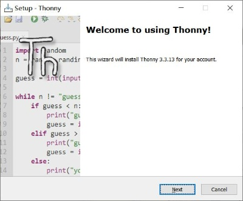

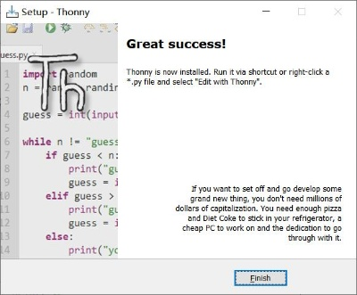

装完了。

## 语言及开发板设置

然后打开Thonny。
在工具栏选择“工具”，选择“设置”，如果是英文版则“Tool”，“Option”
弹出设置窗口，在第一个选项卡”常规“里面有语言设置。

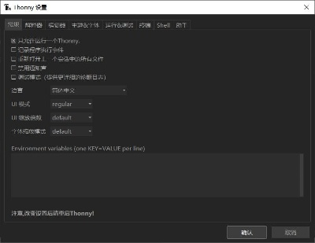

设置完了注意重启。
选择第二栏解释器，选择开发板和端口。ESP32的板选择MicroPython(ESP32)，Pico的板选择MicroPython(Raspberry Pi Pico)

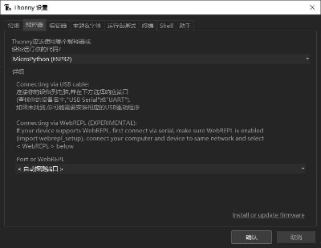

选择端口，建议使用Auto即自动选择端口。

# 使用方式

## 固件烧录

进入之前设置开发板的设置页面，选择右下角的“Install or update firmware”

固件到MicroPython的官网下载：[https://micropython.org/download/esp32/](https://micropython.org/download/esp32/)

选择端口和bin文件，选择安装。

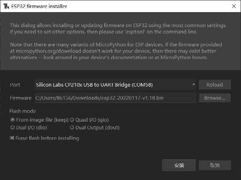

## 连接

用USB线连接后，点击红色STOP按钮

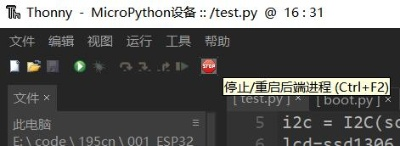

当shell出现MicroPython的文字提示后，即连接成功。

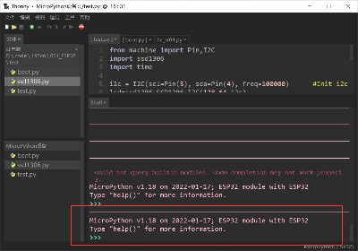

有的时候多次点击STOP仍连接不上，意味着程序陷入循环了。
用鼠标点击SHELL的部分，使其显示光标，然后不停的按CTRL+C就能退出程序并连接上。

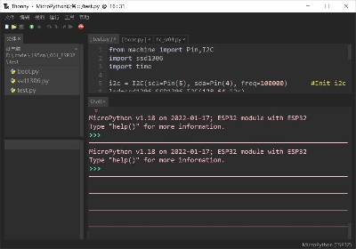

## 软件上传

界面左侧有个文件框，如果刚安装没有显示，选择工具栏"视图"，勾选“文件”。

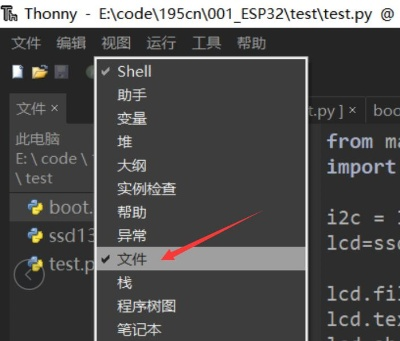

文件框里面的文件位置都是可以点击的，目前只能通过这个方法进入放程序的文件夹。

在要上传到ESP32上的程序上点击右键，选择"上载到/"。

## 出厂批量烧录

按住SHIFT全选文件中的所有程序，右键，选择"上载到/"，即可批量上传。

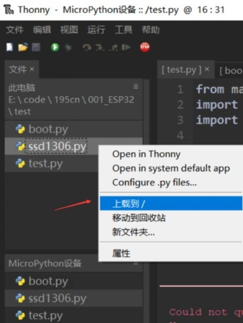

如果之前有程序，会提示是否覆盖，选择确定就行。

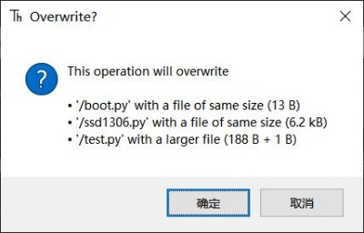
