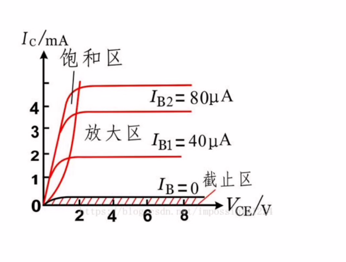

# 005 三极管和MOS管学习记录1

# 前言

简单的学习了三极管和MOS管的知识以后，勉强会用了，现在整理一下基本知识。

主要整理引脚，常见用法，封装参数作为备忘使用。

# 三极管

## 概念

在这个阶段使用的是双极性晶体管，俗称三极管。这种晶体管的工作，同时涉及电子和空穴两种载流子的流动，因此它被称为双极性的，所以也称双极性载流子晶体管。

一种三个引脚的电子元件，通过电流来控制更大的电流。

有两种，一种为NPN型，一种为PNP型。

## 结构

三极管有三个引脚：

- E(Emitter) 发射极

- B(base) 基极

- C(Collector) 集电极

**B基极**是控制引脚。

## 电流方向

三极管的箭头方向是内部PN节的方向，也就是基极电流方向。

NPN的电流方向为CE，BE，PNP的电流方向为EC，BC。

**E发射极**的电流为三极管电流总和，即**Ie = Ib + Ic**。

## 使用方式

**不考虑任何三极管的放大特性，只是用作便宜的开关管。**

如图，典型的三极管电路。

PN节的**正向偏置**就是，二极管正常导通，也就是正极电压超过了导通压降，管内有电流通过。

在三极管饱和时，电流大，负载两端的电压接近供电电压。UC的电压就是三极管的压降，约为0.2V。

UB要导通，一般都要超过PN节的导通电压0.7V。

三极管两个PN节都正偏，也就是饱和导通了，也就是UB>UC。

Datasheet一般会提供三极管特性曲线。

**这个图是根据IB确定的时候，通过调整RC电阻的阻值得到的曲线，并不是单纯的VCE做自变量。**

比如IB=40uA时，把RC从大到小调整，也就是说增加三极管的负载。

- 当RC为较大值时，IC<βIB。URC分压接近VCC，UCE为三级管压降约0.2V，三极管正偏，工作在饱和区。

- 当RC继续减小，负载增大，从饱和区进入到放大区，IC=βIB。UCE就不一定是多少了。

- 当RC减小到短路，VCE直连VCC，有可能进入到击穿区。

这个放大倍数就是电流增益，也称β。

而负载一定时，IC的电流是固定的，也就是说，如果想通过IB控制IC，那么IB需要大于IC/β。而实际应用中，要超额保证电路稳定，IB最好大于5*IC/β。

想要打开三极管时，只要保证IB大于对应的曲线就可以了，这样就进入了饱和区。饱和区相当于三极管CE短路。

关闭时尽量让IB=0，进入截止区。

## 总结

**让BJT进入到饱和状态，需要βIB >> IC。**

BJT起开关作用时，如果想达到负载的理论工作电流IC，那么IB最小为IC/β。

比如要驱动一个100mA的负载，使用8050，取β为200，IB=IC/β=0.5ma。

为了深度饱和，至少3倍以上的IB。

- 如果用5V单片机，电阻最大为10k，建议2k。

- 如果用3.3V单片机，电阻最大为6.6k，2k应该也可以深度饱和了。

看到一句话，很有用：

**反正都要深度饱和，IB能给多大就给多大，直接给到MCU电流上限都可以。**

电流再大的话，就应该考虑用其他元件了。