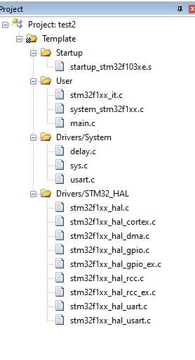

# STM32创建HAL库MDK工程

基于正点原子教程
[【正点原子】手把手教你学STM32 HAL库开发全集【真人出镜】STM32入门教学视频教程 单片机 嵌入式](https://www.bilibili.com/video/BV1bv4y1R7dp/?p=26&spm_id_from=pageDriver&vd_source=3d7a183ebd9d40fbac41c2a6e4f25f74)

P26 第26讲，基础篇，新建HAL版本MDK工程

新建HAL版本MDK工程步骤：

- 新建工程文件夹
- 新建工程框架
- 添加文件
- 魔术棒设置
- 添加用户代码

# 前期准备

准备好开发环境。

先下载固件包，固件包有一些 .c .h .s 文件。

固件包下载流程：

- 去www.st.com
- 搜索 STM32Cube
- 比如开发F1，就下载STM32CubeF1

# 新建工程文件夹

文件夹名称
- Drivers
- Middlewares
- Output
- Projects
- User

## Drivers

存放硬件相关的驱动层文件

分为四个子文件夹：
- BSP
- CMSIS
- SYSTEM
- STM32F1xx_HAL_Driver

直接从正点原子提供的资料包复制。

位置：

D:\书\【正点原子】战舰STM32F103开发板V4 资料盘(A盘)\4，程序源码\2，标准例程-HAL库版本\实验0 基础入门实验\实验0-3，新建工程实验-HAL库版本\Drivers

### BSP

不一定要有，自己新建。
存放开发板支持包驱动代码，比如外设驱动：I2C，SPI，LCD

### CMSIS

CMSIS底层代码，启动文件（.s）等。

### SYSTEM

存放正点原子系统级核心驱动代码，如syrs.c、delay.c和usart.c等

### STM32F1xx_HAL_Driver

ST提供的HAL库驱动

## Middlewares

存放正点原子提供的中间层组件和第三方中间层文件

本实验没有，留空

## Output

存放工程编译输出文件

## Projects

存放MDK（Keil）工程

新创建一个Keil5工程，MCU选择STM32F103ZE。

## User

存放用户程序文件，在固件包例程里。
main.c
stm32f1xx_hal_conf.h
stm32f1xx_it.h
stm32f1xx_it.c

位置：
C:\Users\195\Desktop\Code\STM32_TEST\en.stm32cubef1-v1-8-5\STM32Cube_FW_F1_V1.8.0\Projects\STM3210E_EVAL\Templates

# 添加文件

## Manage Project Items

新建四个分组：
- Startup
- User
- Drivers/System
- Drivers/STM32_HAL

## 添加启动文件
在Startup添加startup_stm32f103xe.s

## 添加SYSTEM源码

添加 
- delay.c 
- sys.c 
- usart.c

整体项目文件结构如下：

# 设置魔术棒

## Target

设置晶振频率：8MHz

设置编译器版本：AC 5

## Output

设置输出文件夹

勾选生成hex

## Listing

同样输出到Output

## C/C++

设置宏定义：
USE_HAL_DRIVER,STM32F103xE

设置头文件包含路径
..\..\Drivers\CMSIS\Device\ST\STM32F1xx\Include
..\..\Drivers\STM32F1xx_HAL_Driver\Inc
..\..\Drivers\CMSIS\Include
..\..\Drivers
..\..\User

设置C99模式

## Debug

选择STLink

## 结束

创建main.c

编译下载